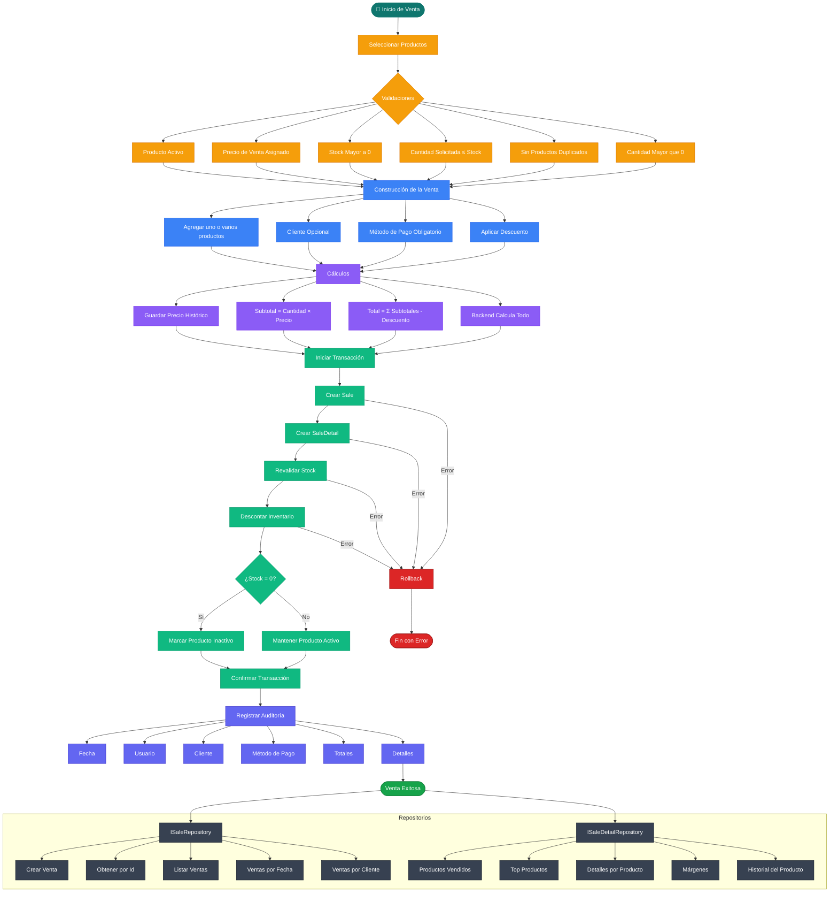

# 🧾 Reglas de Negocio — Proceso de Venta

## 1. Disponibilidad de productos

* Solo se pueden vender productos **activos**.
* Solo se pueden vender productos con **precio de venta asignado**.
* Solo se pueden vender productos con **stock mayor a 0**.

---

## 2. Validación de stock

* No se puede vender una cantidad mayor al stock disponible.
* Si el cliente solicita más unidades de las disponibles → la venta debe bloquearse.
* Esta validación debe existir en:

  * Frontend (UX)
  * Backend (regla obligatoria)

---

## 3. Venta multi-producto

* Una venta puede incluir **uno o varios productos**.
* Todos los productos seleccionados se registran en **una sola venta**.
* Cada producto genera un registro en **SaleDetail**.

---

## 4. Precio histórico

* El precio del producto se guarda al momento de la venta.
* Cambios futuros en el precio del producto **no afectan ventas pasadas**.

---

## 5. Cálculo de subtotales

* Subtotal por producto = `Quantity * UnitPrice`.
* El subtotal debe almacenarse (calculado o persistido).

---

## 6. Cálculo de total de venta

* Total = Suma de subtotales − Descuento.
* El backend es el único responsable de calcular totales.

---

## 7. Descuentos

* Se permite descuento general por venta.
* El descuento no puede ser negativo.
* El descuento no puede ser mayor al subtotal.

---

## 8. Cliente

* El cliente es opcional.
* Si se registra:

  * Se asocia a la venta.
  * Permite envío de factura.
  * Permite trazabilidad de compras.

---

## 9. Método de pago

* Toda venta debe tener método de pago.
* Ejemplos:

  * Efectivo
  * Transferencia
  * Tarjeta
  * Crédito

---

## 10. Descuento de inventario

* Al confirmarse la venta:

  * Se descuenta el stock vendido.
* Debe ejecutarse dentro de una **transacción**.

---

## 11. Inactivación automática

* Si el stock llega a 0:

  * El producto se marca como inactivo.

---

## 12. Integridad transaccional

La operación completa debe ser atómica:

Incluye:

* Crear venta
* Crear detalles
* Descontar stock
* Actualizar producto

Si algo falla → rollback total.

---

## 13. Concurrencia

* El stock debe revalidarse al momento de guardar.
* Evita ventas simultáneas que generen stock negativo.

---

## 14. Restricciones adicionales

* No se permiten ventas sin productos.
* No se permiten cantidades ≤ 0.
* No se permiten productos duplicados en el mismo detalle (deben consolidarse).

---

## 15. Auditoría básica

Cada venta debe registrar:

* Fecha
* Usuario vendedor
* Cliente (opcional)
* Método de pago
* Totales
* Detalles

---

#  Resultado esperado

Un proceso de venta debe garantizar:

* Exactitud financiera
* Integridad de inventario
* Historial de precios
* Trazabilidad de cliente
* Seguridad transaccional

### FLUJO 

Historial de ventas de un producto

ISaleRepository

Operaciones de negocio:

Crear venta completa

Obtener venta por Id

Listar ventas

Ventas por fecha

Ventas por cliente

ISaleDetailRepository

Operaciones analíticas / específicas:

Productos vendidos por fecha

Top productos

Detalles por producto

Márgenes